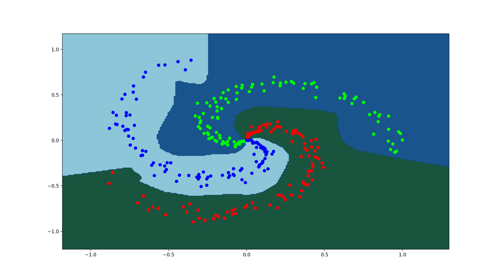

# Autodiff

<br />

<p align="center">
 
</p>

-------

**AutoDiff is intended for educational purposes only.**

**WORK IN PROGRESS*

AutoDiff is a lightweight reverse-mode automatic differentiation (a.k.a
backpropagation) library written in Python with Numpy vectorization.
AutoDiff works by breaking up larger user defined functions into primitive
operators (such as addition, muliplication, etc.) whos derivatives are
pre-defined. Autodiff then dynamically builds a computation graph of the larger
function using these primitive operators during a forward pass and then
applies the chain rule through the backwards pass of the computation
graph to compute the derivative of the larger fucntion wrt some variable.

Though there are various methods to do reverse-mode automatic differentiation.
AutoDiff works via Python's Operator Overloading abilities which is by far the
simplier and more intuitive of the methods. 

This project is still very much a work in progress and I am currently in the
process of building this into a mini deep learning library with support for
training basic MLP's, CNN's, and more. I am also considering on adding support
for higher-order derivatives once I'm done building the support for basic
neural nets. 

---


Table of Contents
=================
   * [Supported Features](#currently-supported-nn-features)
   * [TODO](#todo)
   * [Installation](#installation)
   * [Usage](#usage)
        * Basic Usage
        * Building Simple MLP
        * User Defined Primitives

   * [Liscence](#liscence)


---


<!-- Currently Supported -->
### Currently Supported NN Features:

**Layers:**
 - Linear
 - Sequential
 - Activation Layers


**Activation Functions:**
 - ReLU
 - Leaky ReLU
 - Sigmoid
 - Softmax
 - TanH


**Loss Functions:**
 - MSE 
 - Binary Cross Entropy (Logits)
 - Categorical Cross Entropy 
 - Sigmoid Binary Cross Entropy (Sigmoid + Binary CE)


**Optimizers:**
 - SGD w/ Momentum
 - AdaGrad
 - RMSProp
 - Adam


---


<!-- TODO -->
### TODO:
 - Primitive Functions: Max, Abs
 - Loss Functions: Hinge, MAE, Softmax-CCE
 - Layers: Pooling, Padding, Convolutions, Batch Normalization, Dropout, etc.
 - Utils: One-Hot for CCE-Loss, Split for Test/Train (Tensors), Pre-Defined Datasets
 - Grad Check
 - Hardware Acceleration?
 - Normalization (nn)
 - Lots of Examples
 - Lots of Documentation


---

<!-- INSTALLATION -->
### Installation

At the moment just gonna have to clone the repo and make sure you have numpy
installed which is it's only dependency.

Not tested on Python2.

---

<!-- USAGE -->
### USAGE 

Basic Example Usage:

```python

from autodiff.tensor import Tensor

a = Tensor(2)
b = Tensor(3)

# This is the same as writing f(x) = ((a + b) * a)^2
# We just break it down into primitive ops

z = a + b
y = z * a
x = y ** 2

# This is where the magic happens
x.backward()

print("value: ({})".format(x.value))
print("grad wrt A: ({})".format(a.grad))
print("grad wrt B: ({})".format(b.grad))

```

---

Bulding an MLP to do multiclass Softmax classification is as simple as this:
This example in full detail can be found here: https://github.com/ryanirl/autodiff/blob/main/examples/spiral_classification.py

```python
# Instantiating the Model
model = nn.Sequential(
    nn.Linear(2, 100),
    nn.ReLU(),
    nn.Linear(100, 3),
    nn.Softmax()
)

# Defining the Loss
loss_fun = nn.CategoricalCrossEntropy()

# Defining the Optimizer
optimizer = nn.Adam(model.parameters())

# Training
for i in range(1000):
    optimizer.zero_grad()

    out = model.forward(X)

    loss = loss_fun(out, y)

    if i % 50 == 0: print("loss at {} is: {}".format(i, np.sum(loss.value) / 300))

    loss.backward()

    optimizer.step()

    X.grad = 0 # Required if X is Tensor
    y.grad = 0 # Required if y is Tensor


```

Plotting the decision boundry gives: 


<p align="center">
 
</p>


<br />


---


You can even define your own primitive functions. An example of a user defined
primitive function may be: 


**Note #1:** I will be working on a guide sooon to better explain this code and
how it works to add your own primitive operators.


```python

import numpy as np
from tensor import Tensor, OP
from ops import grad_fun, value_fun
from utils import primitive, check

# NOTE: TANH HAS ALREADY BEEN IMPLEMENTED, THOUGH THIS IS HOW IT
# WOULD WORK IF IT WEREN'T ALREADY 

def e(x): return np.exp(x.value)

value_fun["tanh"] = (lambda x: (e(x) - e(-x)) / (e(x) + e(-x)))

# multiplying each gradient by "g" is requied by the chain rule
grad_fun["tanh"] = (lambda g, x, z: [(g * (1.0 - (z ** 2)))])

@primitive(Tensor)
def tanh(self):
    return OP("tanh", self);


x = Tensor([1, 2, 3])
y = x.tanh()

y.backward()

print("The gradient of y wrt x: {}".format(x.grad))

```


<!-- LISCENCE -->
### LISCENCE

#### MIT
