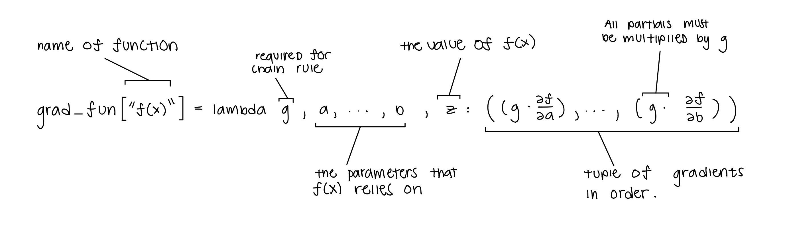

# AutoDiff Guide

## WORK IN PROGESS, PROBABLY DON'T READ THIS


---

### How to Define Custom Primitive Ops

When writing your own primitive ops you need to know 3 things:

1. What primitive OP you want to add
2. How to compute it's value
3. What the derivative is w.r.t. each variable it relies on.

Just as you need to know 3 things before defining your own primitive op. There
are also 3 steps into defining you own primitive OP (and hopefully only 2 in the future). 

Well before we start make sure you have the following imported: 

```python

import numpy as np
from autodiff.tensor import Tensor

# For defining values and gradients of new function (fun)
from autodiff.ops import value_fun, grad_fun 

# primitive is the wrapper that lets you add methods to Tensor
from autodiff.utils import primitive

```

**Step #1:** Defining the value of your new primitive OP. AutoDiff makes use
of python lambda function and for this example we are going to use
the tanh(x) function who's value is as follows:

tanh(x) = (e(x) - e(-x)) / (e(x) + e(-x))

Then to define the value of this OP we do:

```python

def e(x):
    """
    You don't need this I am just using it to simplify
    the value function.

    """
    return np.exp(x.value)

value_fun["tanh"] = (lambda x: (e(x) - e(-x)) / (e(x) + e(-x)))

```

**Step #2:** Defining the gradient of tanh(x). 

This step is by far the most compicated to understand but pretty easy if
you have worked with automatic differentiation before. Hopefully the following
image explains it enough.


<p align="center">
 
</p>


**Note 1:** If the primitve op is a unary operator then we need to wrap the single
defined grad in a list [] so Python can consider it an iterable. This is not needed
for ops that rely on more than one variable.


And because we know the derivative of tanh(x) is: 

tanh'(x): (1.0 - tanh^2(x))

```python

# multiplying each gradient by "g" is requied by the chain rule
grad_fun["tanh"] = (lambda g, x, z: [(g * (1.0 - (z ** 2)))])


```

**Step #3:** For the final step all we need to do is send our new OP to the Tensor class
as a method. We can do this by using the following wrap:

```python

@primitive(Tensor)
def tanh(self):
    return OP("tanh", self);


```

Now we can use the tanh(x) function as if it was a primitive tensor op:

```python

x = Tensor([1, 2, 3])
y = x.tanh()

y.backward()

print(f"The gradient of tanh(x) w.r.t. x is: {x.grad}")

```

**Note 2:** For more intuition into how you might go about defining your own primitive ops.
Feel free to check out autodiff/ops.py where all of the current primitive ops are defined.


---

<br />

Liscense: MIT


